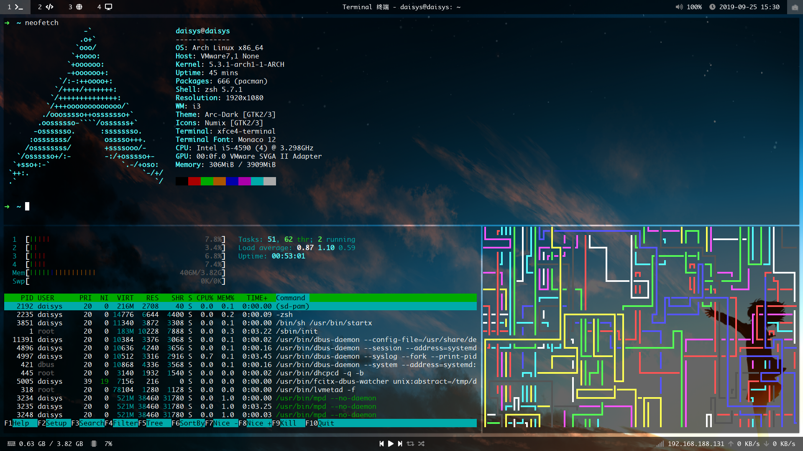

# Moved to https://github.com/sxsw1029/dotfiles

## My i3wm config



### 所需工具
<table>
  <tr>
    <th>i3-gaps</th>
    <th>窗口管理器</th>
  </tr>
  <tr>
    <th>polybar</th>
    <th>状态栏</th>
  </tr>
  <tr>
    <th>xfce4-terminal</th>
    <th>终端</th>
  </tr>
  <tr>
    <th>compton</th>
    <th>透明工具</th>
  </tr>
  <tr>
    <th>feh</th>
    <th>桌面壁纸</th>
  </tr>
  <tr>
    <th>rofi</th>
    <th>程序启动器</th>
  </tr>
  <tr>
    <th>i3lock-fancy-git</th>
    <th>锁屏</th>
  </tr>
  <tr>
    <th>ttf-font-awesome</th>
    <th>图标字体库</th>
  </tr>
</table>

### 配置文件
.xinitrc
```
exec compton -b &
exec i3 -V >> ~/.config/i3/log/i3log-$(date +'%F-%k-%M-%S') 2>&1
```

compton.conf (取消 polybar 阴影)
```
wintypes: {
  dock = {
    shadow = false;
  };
}
```
